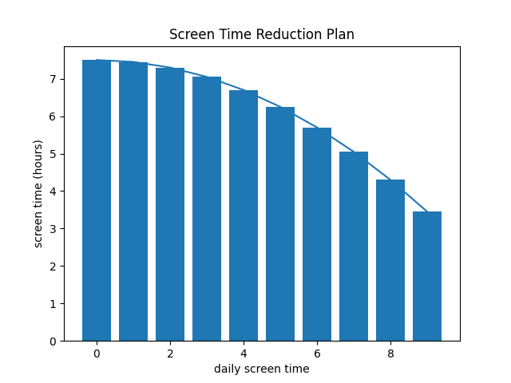

**Screen Time Reduction Planner**

This Python project helps users gradually reduce their daily screen time to a desired goal. By inputting their current average screen time, a target screen time, and the number of days to reach that goal, users receive both:
- A visual plan in the form of a bar graph 
- A daily written schedule showing allowed screen time

**Features**

- Compares your current screen time to the U.S. national average (5.26 hours/day)
- Generates a quadratic decrease plan to your goal screen time 
- Outputs a readable day-by-day screen time schedule 
- Visualizes progress with a Matplotlib graph 
- Uses color-coded terminal output for feedback

**Requirements**

- Python 3.x 


- ```matplotlib```


Install the required package with:

```pip install matplotlib```

**How to Use**

1. Clone or download this repository.

2. Run the script:

```python screen_time_planner.py```

3. Follow the prompts:
- Enter your current daily screen time (in hours)
- Enter your goal screen time (in hours)
- Enter the number of days to achieve your goal

**Example Output**
```
enter your daily average screen time
7.5
your average is 2.24 hours greater than the national average
enter your goal screen time
2.5
enter the days until you reach your goal screen time
10

screentime reduction schedule:
day 0 allotted screen time:
07:30

day 1 allotted screen time:
06:45
...
day 10:
2.5
```
A line graph will also be displayed, showing your screen time trend over time.


**Potential Future Improvements**
- Add input validation and error handling 
- Export the schedule as a CSV or calendar file 
- Allow for nonlinear or customizable reduction curves

**Licence**

This project is for personal use and experimentation. Feel free to adapt it for your own self-improvement tools!
